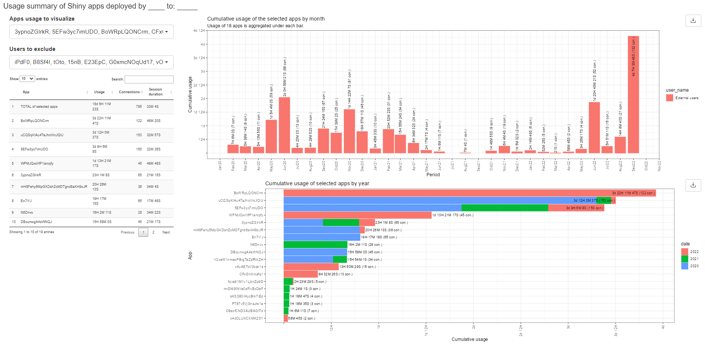

<!-- README.md is generated from README.Rmd. Please edit that file -->

```{r, include = FALSE}
knitr::opts_chunk$set(
  collapse = TRUE,
  comment = "#>",
  fig.path = "man/figures/README-",
  out.width = "100%"
)
```

# rsconnectUsageApp

Is an R package with the functions needed for visualizing usage of the shiny apps on the RStudio connect server. 

<!-- badges: start -->
[](https://lifecycle.r-lib.org/articles/stages.html#experimental)
<!-- badges: end -->


## Installation

You can install the development version of rsconnectUsageApp from [GitHub](https://github.com/wbPTI/rsconnectUsageApp) with:

``` r
# install.packages("devtools")
devtools::install_github("wbPTI/rsconnectUsageApp")
```

## Harvesting usage data

The usages shiny app depends on the usage data that is pre-harvested from the server. To harvest this data, one need to make use of the package `connectapi`:

``` r
remotes::install_github("rstudio/connectapi")
```

```{r}
library(tidyverse)
library(connectapi)
```

Below, we harvest this data from two servers, save it to the `board` in folder `data-raw` and run the app based on this data:

```{r eval=FALSE}
# Reloading data and saving it all in the pins 
client <- connect(prefix = "WBEXTERNAL_NTERNAL")
users <- get_users(client, limit = Inf)
groups <- get_groups(client, limit = Inf)
usage_shiny <- get_usage_shiny(client, limit = Inf)
usage_static <- get_usage_static(client, limit = Inf)
some_content <- get_content(client)


client <- connect(prefix = "WBINTERNAL")
users2 <- get_users(client, limit = Inf)
groups2 <- get_groups(client, limit = Inf)
usage_shiny2 <- get_usage_shiny(client, limit = Inf)
usage_static2 <- get_usage_static(client, limit = Inf)
some_content2 <- get_content(client)


# saving data
dta_bd <- board_folder("data-raw", versioned = FALSE)

# Combining and saving data
dta_bd %>% pin_write(bind_rows(usage_shiny, usage_shiny2),
                     name = "usage_shiny",
                     type = "rds")
dta_bd %>% pin_write(usage_static, name = "usage_static", type = "rds")
dta_bd %>% pin_write(
  users %>%
    filter(!guid  %in% users2$guid) %>%
    bind_rows(users2),
  name = "users",
  type = "rds"
)
dta_bd %>% pin_write(groups, name = "groups", type = "rds")
dta_bd %>% pin_write(
  some_content %>%
    filter(!guid %in% some_content2$guid) %>%
    bind_rows(some_content2),
  name = "some_content",
  type = "rds"
)
```

Example of how the harvested data looks like:

```{r}
all_dta <- rsconnectUsageApp::get_usage_dta("list")
str(all_dta, max.level = 2)
```

Now we can launch app based on this harvested data.

```{r eval=FALSE}
all_dta <- rsconnectUsageApp::get_usage_dta()
run_app(dta = all_dta)
```

This package also contains some dummy data that can be used to launch the app:

```{r eval=FALSE}
run_app(dta = rsconnectUsageApp::usg_dta)
```

Example of the app's layout:

```{r echo=FALSE}

```

