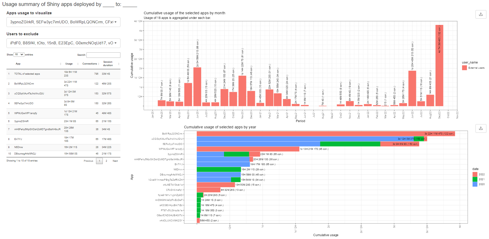

<!-- README.md is generated from README.Rmd. Please edit that file -->

# rsconnectUsageApp

Is an R package with the functions needed for visualizing usage of the
shiny apps on the RStudio connect server.

<!-- badges: start -->

[](https://lifecycle.r-lib.org/articles/stages.html#experimental)
<!-- badges: end -->

## Installation

You can install the development version of rsconnectUsageApp from
[GitHub](https://github.com/wbPTI/rsconnectUsageApp) with:

``` r
# install.packages("devtools")
devtools::install_github("wbPTI/rsconnectUsageApp")
```

## Harvesting usage data

The usages shiny app depends on the usage data that is pre-harvested
from the server. To harvest this data, one need to make use of the
package `connectapi`:

``` r
remotes::install_github("rstudio/connectapi")
```

``` r
library(tidyverse)
#> ── Attaching packages ─────────────────────────────────────── tidyverse 1.3.1 ──
#> ✔ ggplot2 3.3.6     ✔ purrr   0.3.4
#> ✔ tibble  3.1.7     ✔ dplyr   1.0.9
#> ✔ tidyr   1.2.0     ✔ stringr 1.4.1
#> ✔ readr   2.1.2     ✔ forcats 0.5.2
#> Warning: package 'stringr' was built under R version 4.2.1
#> Warning: package 'forcats' was built under R version 4.2.1
#> ── Conflicts ────────────────────────────────────────── tidyverse_conflicts() ──
#> ✖ dplyr::filter() masks stats::filter()
#> ✖ dplyr::lag()    masks stats::lag()
library(connectapi)
#> Registered S3 methods overwritten by 'connectapi':
#>   method            from  
#>   dim.tbl_lazy      dbplyr
#>   dimnames.tbl_lazy dbplyr
```

Below, we harvest this data from two servers, save it to the `board` in
folder `data-raw` and run the app based on this data:

``` r
# Reloading data and saving it all in the pins 
client <- connect(prefix = "WBEXTERNAL_NTERNAL")
users <- get_users(client, limit = Inf)
groups <- get_groups(client, limit = Inf)
usage_shiny <- get_usage_shiny(client, limit = Inf)
usage_static <- get_usage_static(client, limit = Inf)
some_content <- get_content(client)


client <- connect(prefix = "WBINTERNAL")
users2 <- get_users(client, limit = Inf)
groups2 <- get_groups(client, limit = Inf)
usage_shiny2 <- get_usage_shiny(client, limit = Inf)
usage_static2 <- get_usage_static(client, limit = Inf)
some_content2 <- get_content(client)


# saving data
dta_bd <- board_folder("data-raw", versioned = FALSE)

# Combining and saving data
dta_bd %>% pin_write(bind_rows(usage_shiny, usage_shiny2),
                     name = "usage_shiny",
                     type = "rds")
dta_bd %>% pin_write(usage_static, name = "usage_static", type = "rds")
dta_bd %>% pin_write(
  users %>%
    filter(!guid  %in% users2$guid) %>%
    bind_rows(users2),
  name = "users",
  type = "rds"
)
dta_bd %>% pin_write(groups, name = "groups", type = "rds")
dta_bd %>% pin_write(
  some_content %>%
    filter(!guid %in% some_content2$guid) %>%
    bind_rows(some_content2),
  name = "some_content",
  type = "rds"
)
```

Example of how the harvested data looks like:

``` r
all_dta <- rsconnectUsageApp::get_usage_dta("list")
str(all_dta, max.level = 2)
#> List of 4
#>  $ usage_shiny: tibble [2,411 × 5] (S3: tbl_df/tbl/data.frame)
#>  $ users      : tibble [665 × 11] (S3: tbl_df/tbl/data.frame)
#>  $ groups     : tibble [15 × 3] (S3: tbl_df/tbl/data.frame)
#>  $ content    : tibble [479 × 32] (S3: tbl_df/tbl/data.frame)
```

Now we can launch app based on this harvested data.

``` r
all_dta <- rsconnectUsageApp::get_usage_dta()
run_app(dta = all_dta)
```

This package also contains some dummy data that can be used to launch
the app:

``` r
run_app(dta = rsconnectUsageApp::usg_dta)
```

Example of the app’s layout:


